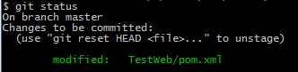
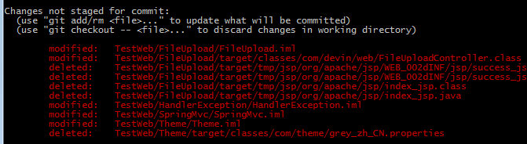
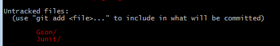

删除仓库中目录或文件
---
　git rm -r 目录 或者 git rm 文件
　git commit -m "" 提交
　误删可以恢复
　git checkout -- 文件

忽略特殊文件
---
　在git工作区间根目录创建.gitignore文件，然后把要忽略的文件添加进去。
　Window环境创建该文件会提示输入文件名，但是在文本编辑器里“保存”或者“另存为”就可以把文件保存为.gitignore 然后把该文件提交到git
　A、被忽略的文件，要强制添加到git
　　　git add -f 文件
　B、查看忽略文件被个规则忽略了
　　　git check-ignore -v 文件
　常见的忽略文件：https://github.com/github/gitignore

撤销文件修改
---
　A、已经git add到暂存区，如图：
　
　
　git reset HEAD file 可把暂存区的修改销掉，重新放回工作区
　git reset命令既可以回退版本，也可以把暂存区的修改回退到工作区。当我们用HEAD时，表示最新的版本。
 
　B、还没git add到暂存区，如图：
　
　git checkout -- 文件 丢弃工作区的修改
　命令“git checkout -- 文件”是：把readme.txt文件在工作区的修改全部撤销，这里有两种情况：
　一种是readme.txt自修改后还没有被放到暂存区，撤销修改就回到和版本库一模一样的状态；
　一种是readme.txt已经添加到暂存区后，又作了修改，撤销修改就回到添加到暂存区后的状态。
删除仓库中文件，本地文件保留
---
　git rm --cached filename
　git rm -r --cached path
让git push命令不需要密码
---
　GitHub获得远程库时，有ssh方式和https方式。使用ssh时保存密钥对以后可以不再输入帐号密码，而https却不能。已经存在的项目修改.git目录下的config文件中的url。

中文显示问题
---
git config --global core.quotepath false
还原文件内容
---
使用git checkout file 还原本地修改。如果文件没有add到缓存区，使用IDE的Local History记录，来恢复原来被还原文件的修改内容。