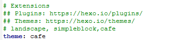
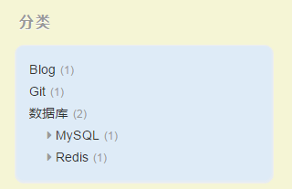
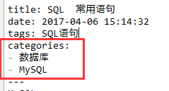
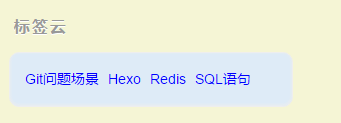
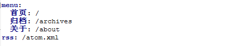

设置主题
---
　[官方主题网站](https://hexo.io/themes/)，在主题下载放到themes目录。然后修改_config.yml配置文件
　
评论插件
---
　使用的是[Cafe](https://github.com/giscafer/hexo-theme-cafe)主题，由于[多说](http://dev.duoshuo.com/threads/58d1169ae293b89a20c57241)项目关闭，所以使用时国外[Disqus](https://disqus.com/)评论。<br/>
　Cafe的_config.yml配置文件有说明，在博客的_config.yml文件配置disqus的账号就可以
　
#### 注册Disqus账号
　在admin里，setting里的shortname名字才是配置到_config.yml文件中的
　
分类
---
　配置像这个分层次的分类
　
　
标题
---
使用markdown的#标题时，#和标题要隔个空格，否则解析不了。
云标签
---
　把Cafe的tagcloud_color设置为true
　
配置关于界面
---
　使用hexo new page "about"创建about的页面，在_config.yml中可以修改about名称
　
文章中插入图片
---
　在博客的_config.yml文件设置post_asset_folder为true。在建立文件时，Hexo会自动建立一个与文章同名的文件夹，用来放资源的。
然后安装[hexo-asset-image](https://github.com/CodeFalling/hexo-asset-image)插件npm install hexo-asset-image --save。通过下面方法就可以在文章插入图片。
``` bash
	 其中[]里面不写文字则没有图片标题。
	而 生成HTML文件图片路径错误
```
RSS订阅
---
执行命令安装插件
``` bash
	npm install hexo-generator-feed --save
```
在博客的_config.yml文件配置
``` bash
	# RSS订阅支持
	plugin:
	- hexo-generator-feed
	
	# Feed Atom
	feed:
	type: atom
	path: atom.xml
	limit: 20
```
Google Analytics
---
　在主题的_config.yml文件配置如下,id是Google Analytics生成的追踪id,需要去Google Analytics官网创建。
``` bash
google_analytics:
  enable: true
  id: UA-97173941-1
  site: auto
```
提交搜索引擎（百度+谷歌）
---
　[参考博客](http://www.jianshu.com/p/619dab2d3c08)